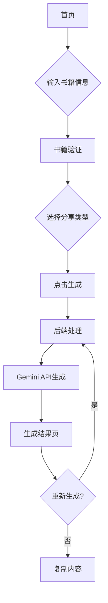

## 1. 产品概述
一个自动生成自然、人性化书籍分享内容的网站。用户输入书籍信息后，系统会生成适合社交媒体分享的书籍推荐内容，避免AI痕迹，让分享看起来更真实自然。

目标用户：热爱阅读、经常在社交媒体分享读书心得的用户，以及需要书籍推荐内容的营销人员。

## 2. 核心功能

### 2.1 用户角色
本产品为单用户角色设计，无需注册登录即可使用基础功能。

### 2.2 功能模块
网站包含以下核心页面：
1. **首页**：书籍信息输入、分享类型选择、生成功能
2. **生成结果页**：展示生成的分享内容、重新生成功能

### 2.3 页面详情

| 页面名称 | 模块名称 | 功能描述 |
|---------|---------|----------|
| 首页 | 书籍信息输入区 | 输入书籍标题（必填）、作者（选填）、个人阅读体验（选填） |
| 首页 | 分享类型选择 | 选择完整分享或部分分享模式 |
| 首页 | 生成按钮 | 点击生成书籍分享内容 |
| 首页 | 书籍验证状态 | 实时显示书籍存在性和合法性检查结果 |
| 生成结果页 | 内容展示 | 显示生成的自然语言书籍分享内容 |
| 生成结果页 | 章节引用 | 如提供个人体验，显示相关章节引用 |
| 生成结果页 | 重新生成 | 重新生成新的分享内容 |
| 生成结果页 | 复制功能 | 一键复制生成的分享内容 |

## 3. 核心流程

用户操作流程：
1. 用户进入首页，输入书籍信息
2. 系统实时验证书籍存在性和合法性
3. 用户选择分享类型（完整分享/部分分享）
4. 点击生成按钮
5. 系统调用后端API进行处理
6. 后端进行提示词工程优化
7. 调用Gemini API生成自然语言内容
8. 返回生成结果并展示

## 4. 用户界面设计

### 4.1 设计风格
- **主色调**：温暖的知识橙色 (#FF6B35) 搭配深空蓝 (#1A1A2E)
- **按钮样式**：现代圆角设计，悬停效果明显
- **字体**：中文使用思源黑体，英文字体使用Inter
- **布局风格**：卡片式布局，居中设计，响应式栅格
- **图标风格**：使用简洁的线条图标，如书籍、分享、复制等

### 4.2 页面设计概览

| 页面名称 | 模块名称 | UI元素 |
|---------|---------|---------|
| 首页 | 输入区域 | 大尺寸输入框，清晰占位符文字，实时验证反馈 |
| 首页 | 分享类型 | 两个大按钮，图标区分，选中状态明显 |
| 首页 | 生成按钮 | 醒目的橙色按钮，加载状态显示 |
| 生成结果页 | 内容展示 | 优雅的卡片设计，适当的行间距和段落间距 |
| 生成结果页 | 操作按钮 | 底部固定的操作栏，包含复制和重新生成 |

### 4.3 响应式设计
采用桌面优先设计，完美适配移动端：
- 桌面端：最大宽度1200px，内容居中显示
- 平板端：自适应布局，保持良好的阅读体验
- 移动端：单列布局，触摸友好的按钮尺寸

### 4.4 交互优化
- 输入框获得焦点时边框高亮
- 按钮点击有视觉反馈
- 生成过程显示加载动画
- 复制成功后显示提示信息