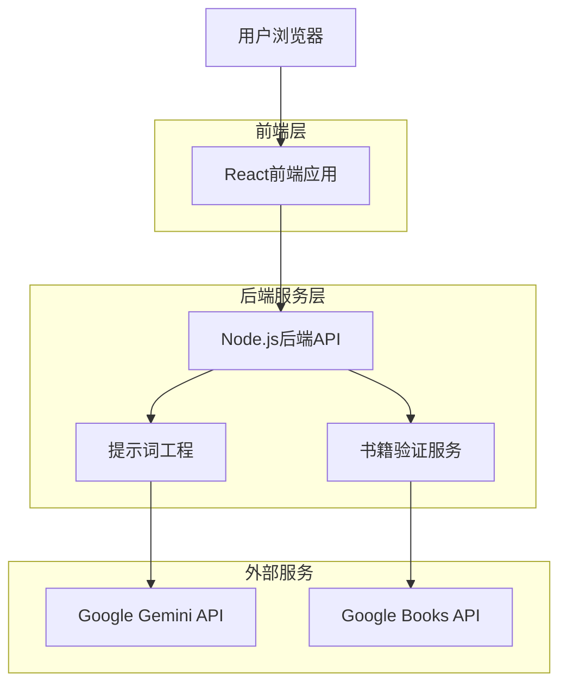
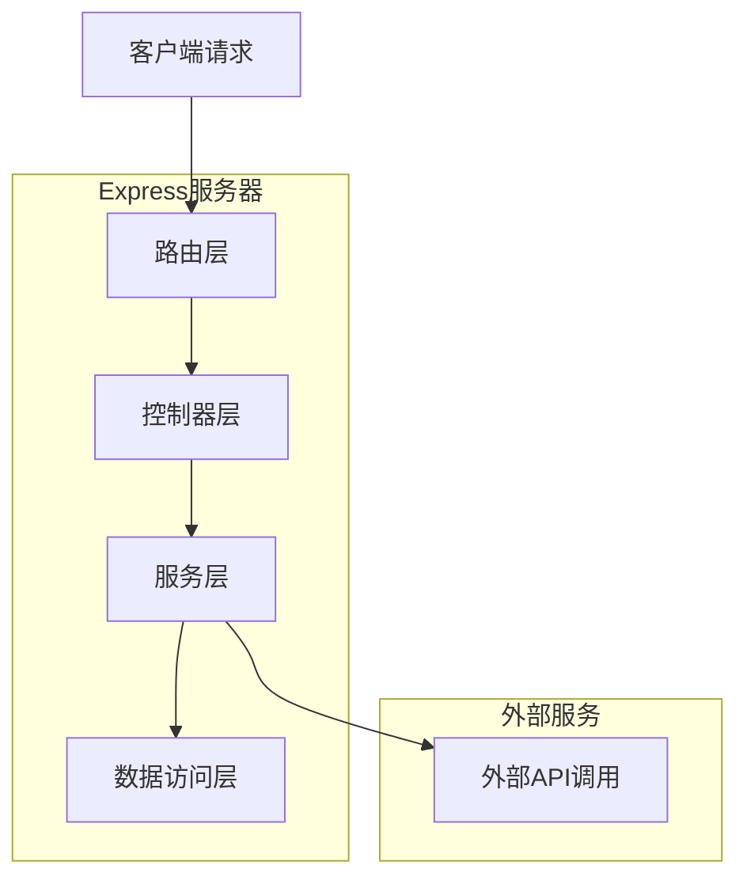
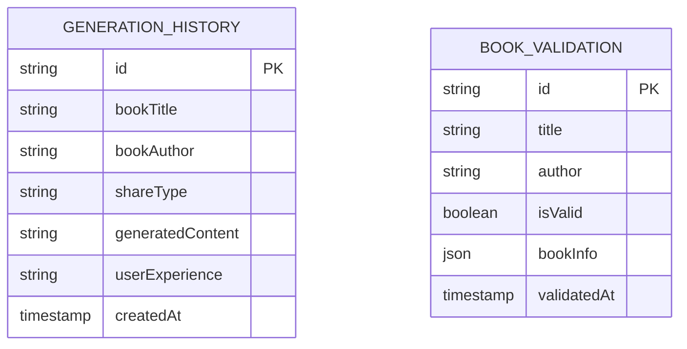

## 1. 架构设计



## 2. 技术描述

- **前端**: React@18 + Tailwind CSS@3 + Vite
- **初始化工具**: vite-init
- **后端**: Node.js + Express@4
- **AI服务**: Google Gemini API
- **书籍验证**: Google Books API
- **部署平台**: Vercel

## 3. 路由定义

| 路由 | 用途 |
|------|------|
| / | 首页，书籍信息输入和生成功能 |
| /generate | 生成结果页面，展示生成的分享内容 |
| /api/validate-book | 后端API，验证书籍存在性和合法性 |
| /api/generate-share | 后端API，生成书籍分享内容 |

## 4. API定义

### 4.1 书籍验证API

```
POST /api/validate-book
```

请求参数：
| 参数名 | 参数类型 | 是否必需 | 描述 |
|--------|----------|----------|------|
| title | string | true | 书籍标题 |
| author | string | false | 作者名称 |

响应参数：
| 参数名 | 参数类型 | 描述 |
|--------|----------|------|
| valid | boolean | 书籍是否有效 |
| bookInfo | object | 书籍详细信息 |
| message | string | 验证结果说明 |

请求示例：
```json
{
  "title": "百年孤独",
  "author": "加西亚·马尔克斯"
}
```

### 4.2 内容生成API

```
POST /api/generate-share
```

请求参数：
| 参数名 | 参数类型 | 是否必需 | 描述 |
|--------|----------|----------|------|
| title | string | true | 书籍标题 |
| author | string | false | 作者名称 |
| experience | string | false | 个人阅读体验 |
| shareType | string | true | 分享类型(full/partial) |

响应参数：
| 参数名 | 参数类型 | 描述 |
|--------|----------|------|
| content | string | 生成的分享内容 |
| citations | array | 章节引用（如适用） |
| success | boolean | 生成是否成功 |

请求示例：
```json
{
  "title": "百年孤独",
  "author": "加西亚·马尔克斯",
  "experience": "这本书让我深刻理解了孤独的本质",
  "shareType": "full"
}
```

## 5. 服务器架构图



## 6. 数据模型

### 6.1 数据模型定义



### 6.2 数据定义语言

生成历史表（generation_history）
```sql
-- 创建表
CREATE TABLE generation_history (
    id UUID PRIMARY KEY DEFAULT gen_random_uuid(),
    book_title VARCHAR(500) NOT NULL,
    book_author VARCHAR(200),
    share_type VARCHAR(20) NOT NULL CHECK (share_type IN ('full', 'partial')),
    generated_content TEXT NOT NULL,
    user_experience TEXT,
    created_at TIMESTAMP WITH TIME ZONE DEFAULT NOW()
);

-- 创建索引
CREATE INDEX idx_generation_history_created_at ON generation_history(created_at DESC);
CREATE INDEX idx_generation_history_book_title ON generation_history(book_title);
```

书籍验证表（book_validation）
```sql
-- 创建表
CREATE TABLE book_validation (
    id UUID PRIMARY KEY DEFAULT gen_random_uuid(),
    title VARCHAR(500) NOT NULL,
    author VARCHAR(200),
    is_valid BOOLEAN NOT NULL,
    book_info JSONB,
    validated_at TIMESTAMP WITH TIME ZONE DEFAULT NOW()
);

-- 创建索引
CREATE INDEX idx_book_validation_title ON book_validation(title);
CREATE INDEX idx_book_validation_validated_at ON book_validation(validated_at DESC);
```

## 7. 安全考虑

- API密钥存储在服务器环境变量中，不暴露给前端
- 实现请求频率限制，防止API滥用
- 对用户输入进行验证和清理，防止注入攻击
- 使用HTTPS协议进行数据传输
- 对生成的内容进行适当的内容安全检查